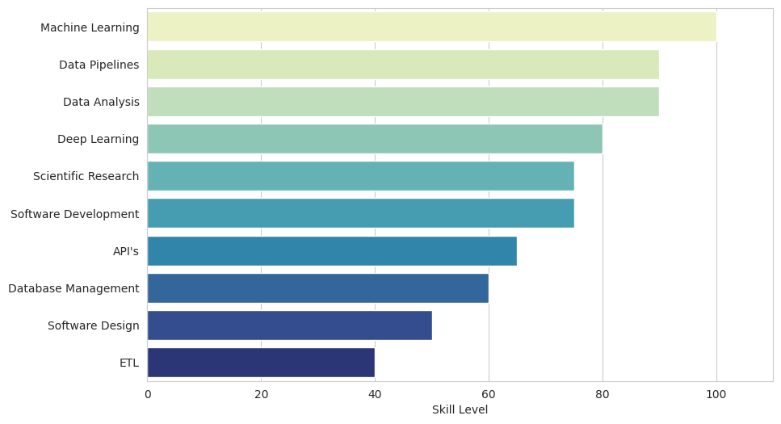
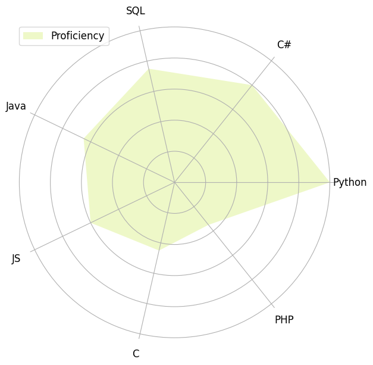
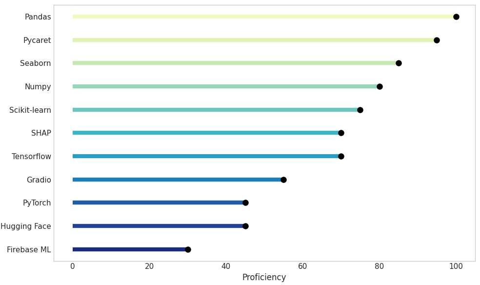
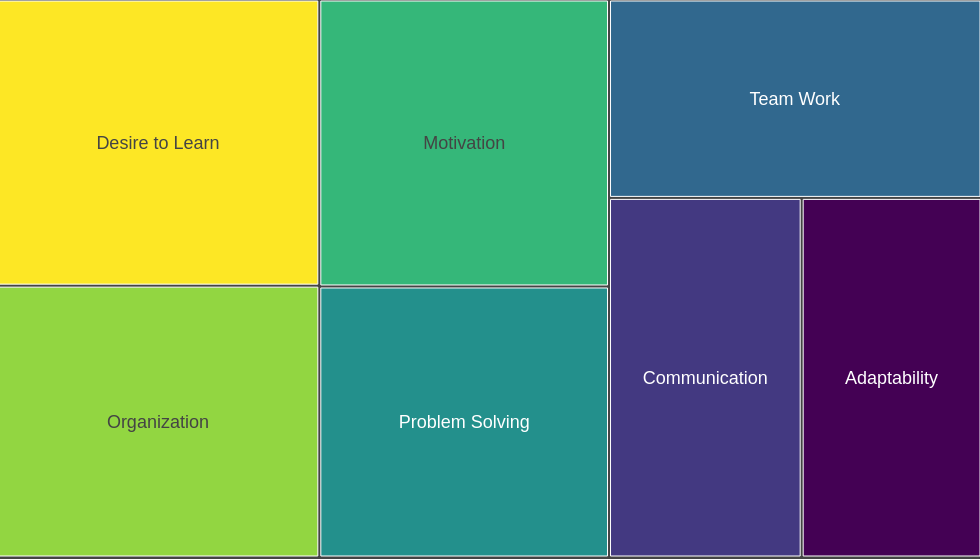

    

I am a highly motivated computer engineer, holding a Master's Degree in Computer Engineering with a specialization in Intelligent Data Analysis from Polytechnic of Coimbra. My academic journey has also instilled in me a deep passion for autonomous and continuous learning.

---

## Projects

### [Risk assessment for progression of Diabetic Nephropathy based on patient history analysis - Master's Dissertation](https://comum.rcaap.pt/handle/10400.26/47587)

Longitudinal Machine Learning Modeling for Diabetic Nephropathy with a 22-year patient dataset tracked by the Portuguese Diabetes Association (APDP), enabling precise prediction of disease evolution and fostering personalized healthcare strategies.

- **Pandas, Sweetviz and Pandas Profiling**: Data manipulation and Exploratory Data Analysis
- **Seaborn**: Data visualization
- **scikit-learn**: Machine learning models
- **PyCaret**: Automated machine learning
- **SHapley Additive exPlanations (SHAP)**: Explainable AI
- **Gradio:**: Interactive ML interface
- **Hugging Face**: Hosting ML model

### [Interpretable Heart Disease Machine Learning Classifier](https://github.com/Francisc17/Hearth-Disease-Interpretability-Research)

An analysis of clinical data to predict heart disease in patients. The solution focuses on creating an ML model capable of predicting the disease and showing how the algorithm arrived at its prediction.

- **Pandas**: Data manipulation and analysis
- **Seaborn**: Data visualization
- **scikit-learn**: Machine learning models
- **PyCaret**: Automated machine learning
- **SHapley Additive exPlanations (SHAP)**: Explainable AI

### [Interpretation of Convolutional Neural Networks (CNNs)](https://github.com/Francisc17/CNN-Interpretation)

Exploring techniques to interpret Convolutional Neural Networks (CNNs), popular deep learning models for image classification. Techniques include GradCAM, Lime, Rise, and more.

- **Pandas**: Data manipulation and analysis
- **Seaborn**: Data visualization
- **Tensorflow**: Deep Learning framework library
- **OpenCV**: Open source library for computer vision

### [English to Cherokee Translator using Transformers](https://github.com/Francisc17/Translator-English-to-Cherokee)

Using Transformers to create an English to Cherokee translator, exploring different pre-trained architectures like BERT and Helsinki NLP.

- **Pandas**: Data manipulation and analysis
- **Tensorflow**: Deep Learning framework library
- **Simple Transformers**: Natural language processing library
- **Hugging Face**: Open source data science and machine learning platform

---

## Scientific Research

    <strong>ORCID:</strong>
    <a href="https://orcid.org/0000-0001-7000-6967" target="_blank">0000-0001-7000-6967</a>

### [Machine learning techniques to predict the risk of developing diabetic nephropathy: a literature review](https://link.springer.com/article/10.1007/s40200-023-01357-4)

Conducted research on Machine Learning approaches to enhance Diabetic Nephropathy risk prediction through comprehensive temporal analysis of clinical data, emphasizing the crucial integration of Electronic Health Records for more reliable models.

**Published on Journal of Diabetes & Metabolic Disorders on 5 December 2023**

### [Depression Detection Using Deep Learning and Natural Language Processing Techniques: A Comparative Study](https://link.springer.com/chapter/10.1007/978-3-031-49018-7_24)

This research suggests the use of Natural Language Processing (NLP) techniques to spot signs of depression in tweets, finding success with an 84.83% accuracy using a method called Extra Trees combined with TF-IDF feature extraction method.

**Presented at CIARP 2023: Progress in Pattern Recognition, Image Analysis, Computer Vision, and Applications on 29 November 2023**

### [Oversampling Techniques for Diabetes Classification: a Comparative Study](https://ieeexplore.ieee.org/abstract/document/9657542)

A comparative study on the combination of SMOTE oversampling technique variants and machine learning algorithms for diabetes prediction using the unbalanced "PIMA Indian Diabetes" dataset.

**Presented at the 2021 International Conference on e-Health and Bioengineering (EHB) on 31 December 2021.**

### [Predicting Type 2 Diabetes Through Machine Learning: Performance Analysis in Balanced and Imbalanced Data](https://link.springer.com/chapter/10.1007/978-3-030-86356-2_22)

Addressing the prediction of Type 2 diabetes using the "PIMA Indians Diabetes" dataset. The study involves creating a balanced dataset and evaluating various machine learning methods.

**Presented at the International Symposium on Ubiquitous Networking on 11 December 2021.**

---
## Learning

    

        "I don't know what's the matter with people: they don't learn by understanding; they learn by some other way - by rote, or something. Their knowledge is so fragile!" - Richard Feynman
    

I have a strong passion for continuous learning, with a primary focus on Data Science and Machine Learning. However, I also find great joy in exploring diverse subjects across various domains to expand my knowledge base. My commitment to learning extends to meticulous note-taking, where I document concepts in practice and theory from a wide range of sources, including papers, web articles, books, online courses, and other valuable learning resources.  

**Learning Notes available on:** [https://github.com/Francisc17/Learning_Notes](https://github.com/Francisc17/Learning_Notes)

---

## Skills

    

---

## Programming Languages

    

---

## Data Science libraries and frameworks

    

---

## Soft Skills

    

